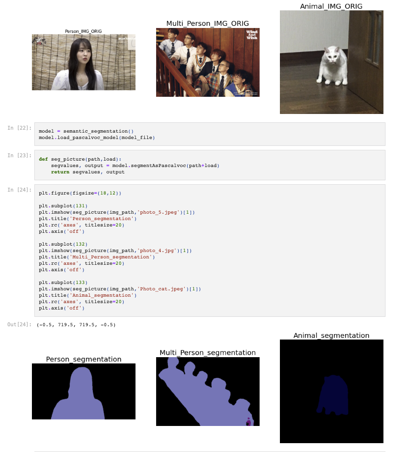

# AIFFEL Campus Online Code Peer Review
- 코더 : 서민성
- 리뷰어 : 정호재


# PR(Peer Review)
- [X]  **1. 주어진 문제를 해결하는 완성된 코드가 제출되었나요?**
    - 문제에서 요구하는 최종 결과물이 첨부되었는지 확인
    - 문제를 해결하는 완성된 코드란 프로젝트 루브릭 3개 중 2개, 
    퀘스트 문제 요구조건 등을 지칭
        - [X] 인물모드 사진을 성공적으로 제작
        - [X] 제작한 인물모드 사진들에서 나타나는 문제점을 정확히 지적
        - [ ] 인물모드 사진의 문제점을 개선할 수 있는 솔루션을 적절히 제시
    
- []  **2. 전체 코드에서 가장 핵심적이거나 가장 복잡하고 이해하기 어려운 부분에 작성된 
주석 또는 doc string을 보고 해당 코드가 잘 이해되었나요?**
    - 해당 코드 블럭에 doc string/annotation이 달려 있는지 확인
    - 해당 코드가 무슨 기능을 하는지, 왜 그렇게 짜여진건지, 작동 메커니즘이 뭔지 기술.
          
          함수 remove_picture의 return 값은 두 개이다. img_bg_blur, img_mask_color
          img_bg_blur는 마스크 부분을 제외하고 배경을 블러 처리하였고 마스크 부분은 검은색이다.
          img_mask_color는 마스크 부분이 하얀색으로 칠하고 다른 부분은 검은색으로 칠한다
          위 두 함수를 이용해서 인자를 각각 a_1, hum_orig으로 받은 후 이를
          plt.imshow(cv2.cvtColor(np.where(a_1==255, hum_orig, a), cv2.COLOR_BGR2RGB)) 처럼 적용하면 배경이 블러처리된 그림을 얻을 수 있다.  
    - 주석을 보고 코드 이해가 잘 되었는지 확인
          주석이 조금 부족한 것 같다.  
        
- [X]  **3. 에러가 난 부분을 디버깅하여 문제를 “해결한 기록을 남겼거나” 
”새로운 시도 또는 추가 실험을 수행”해봤나요?**
    - 문제 원인 및 해결 과정을 잘 기록하였는지 확인
    - 문제에서 요구하는 조건에 더해 추가적으로 수행한 나만의 시도, 
    실험이 기록되어 있는지 확인  
    
        
- [ ]  **4. 회고를 잘 작성했나요?**
    - [ ] **추후 작성 필요**
        
- [X]  **5. 코드가 간결하고 효율적인가요?**
    - 파이썬 스타일 가이드 (PEP8) 를 준수하였는지 확인
          - 네 그렇습니다.
    - 하드코딩을 하지않고 함수화, 모듈화가 가능한 부분은 함수를 만들거나 클래스로 짰는지
    - 코드 중복을 최소화하고 범용적으로 사용할 수 있도록 함수화했는지
        - 함수 정의 및 적용  
        
        - 크기 조정  
        

# 참고 링크 및 코드 개선
```
# 코드 리뷰 시 참고한 링크가 있다면 링크와 간략한 설명을 첨부합니다.
# 코드 리뷰를 통해 개선한 코드가 있다면 코드와 간략한 설명을 첨부합니다.
```
